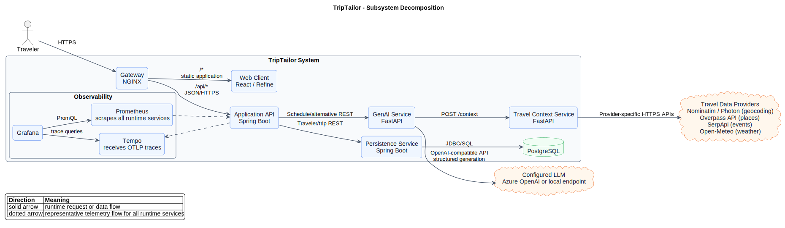
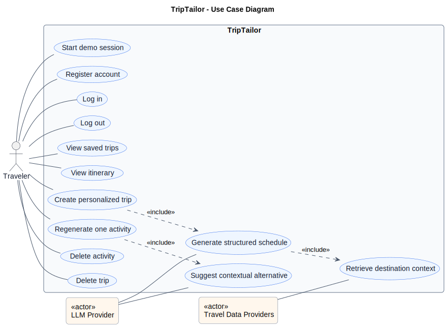
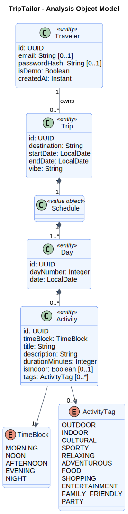

# Continuous Vacation (Dynamic Travel Itinerary Builder)

## Problem Statement

Planning a trip is often overwhelming, requiring travelers to juggle multiple websites, blogs, and notes to build a coherent daily schedule. While standard AI tools can suggest itineraries, they usually provide static, overwhelming walls of text. If a traveler needs to change one detail—like swapping an outdoor activity due to rain—they have to start over, which often messes up the rest of the timeline. This application solves this by providing a dynamic, visual itinerary where individual time blocks can be independently adjusted, saved, and managed with ease.

### What is the main functionality?

- **Instant Access:** Users can immediately dive into the app and start planning using a seamless demo profile, skipping lengthy registration processes entirely.
- **Custom Trip Creation:** Users input a destination, travel dates, and a preferred "vibe" (e.g., Foodie, Historic, Relaxing). The system generates a highly customized, day-by-day itinerary.
- **Visual Schedule Display:** Instead of a chat interface, the itinerary is presented as an easy-to-read, structured schedule divided into specific Days and time blocks (Morning, Afternoon, Evening).
- **Micro-Regeneration (Spot Editing):** Users can tweak a single activity block (e.g., typing "Swap this for an indoor activity") without regenerating or breaking the rest of their trip schedule.
- **Trip Dashboard & Auto-Save:** All generated itineraries and micro-edits are automatically saved. Users are greeted with a clean dashboard where they can view, resume, or delete their planned trips to keep their workspace organized.
- **Graceful Error Handling:** If the AI encounters a hiccup while generating a plan, the app safely catches the issue and provides a friendly prompt to try again, ensuring the app never freezes or crashes.

### Who are the intended users?

- Casual travelers and weekend backpackers who want to quickly draft a structured travel schedule without spending hours researching.
- Travelers who need on-the-fly flexibility to adjust specific parts of their plans due to weather, changing interests, or time constraints.

### How will you integrate GenAI meaningfully?

- The AI acts as an intelligent, behind-the-scenes travel agent rather than a conversational chatbot.
- Instead of generating free-flowing text, the AI is strictly constrained to output structured scheduling data. It takes the user's destination, dates, and vibe, and returns precise daily activities complete with titles, descriptions, and durations.
- The AI is also used for targeted problem-solving. When a user wants to change a specific block, the AI understands the context of that single activity and offers a suitable replacement based on the user's instructions, leaving the rest of the itinerary perfectly intact.

### Describe some scenarios of how your app will function

**Scenario 1: The Initial Generation (Full System Flow)**
The user opens the app and enters "Munich, 3 days in mid may, sporty vibe." The application processes this request through the AI engine. After a few seconds, the user is presented with a beautifully formatted 3-day schedule, neatly divided into morning, afternoon, and evening blocks with specific activities. This trip is automatically saved to their personal dashboard so they can close the app and return to it later.

**Scenario 2: The Rainy Day Swap (Micro-Regeneration)**
While reviewing their saved trip, the user looks at Day 2, Afternoon: "Walking tour of the English Garden." Realizing the forecast calls for rain, they click an "Edit" button on that specific activity block and type "Make this indoor." The AI processes this targeted request and suggests "Visit the Deutsches Museum." The schedule instantly updates that single card on the screen, keeping the morning and evening plans exactly as they were.

## Local Configuration

The travel context service uses SerpApi for Google Events. Create `travel-context-service/.env` from `travel-context-service/.env.example` and set `SERPAPI_API_KEY`; without it, event lookup is skipped and trip context responses contain no events.

## Service Map

TripTailor runs as five application services plus Postgres:

| Service | Path | Responsibility |
| --- | --- | --- |
| Frontend | `frontend/` | React, Vite, and Refine UI for authentication, trip creation, trip listing, and itinerary editing. |
| Backend API | `backend/` | Public Spring Boot backend-for-frontend. Owns auth, JWT validation, trip orchestration, and calls to internal services. |
| Persistence Service | `persistence-service/` | Internal Spring Boot database access layer for travelers, trips, days, activities, and tags. |
| GenAI Service | `genai-service/` | Internal FastAPI service that prompts the configured LLM and validates structured itinerary output. |
| Travel Context Service | `travel-context-service/` | Internal FastAPI enrichment service for geocoding, events, places, weather, ranking, and cache-backed provider calls. |
| Database | Docker Compose / Helm | PostgreSQL backing the persistence service. |

In Docker Compose and Kubernetes, the gateway exposes the frontend and routes `/api/*` to the backend. Persistence, GenAI, travel-context, and Postgres are internal implementation services.

## Architecture

TripTailor uses independently deployable services with explicit HTTP contracts. The browser loads the React application through the NGINX gateway and sends all application requests to the public Spring Boot backend. That backend is the system's security and orchestration boundary: it authenticates travelers with signed JWTs, validates public requests, coordinates trip generation, and prevents clients from calling internal services directly.

The backend delegates durable state to the persistence service, which is the only application service allowed to access PostgreSQL. For trip creation and activity regeneration, the backend calls the GenAI service. The GenAI service builds prompts, requests structured output from the configured LLM, validates that output with Pydantic models, and assigns the identifiers required by the application contract. Before schedule generation, it requests destination context from the travel-context service. That service encapsulates geocoding, place, event, and weather providers, including caching and ranking, so provider-specific concerns do not leak into trip orchestration.

All application-owned HTTP service interfaces use JSON and are described in `api-specification/`. The public contract is `frontend.yaml`; internal contracts isolate persistence, GenAI, and travel-context behavior. Runtime deployment is available through Docker Compose and the Helm chart. Prometheus scrapes every backend service, Grafana visualizes the exported metrics, and Tempo receives distributed traces.

### Subsystems and interfaces

| Caller | Callee | Interface | Responsibility |
| --- | --- | --- | --- |
| Browser frontend | Backend API | `/api/*` through NGINX; public OpenAPI contract | Authentication and traveler-facing trip workflows |
| Backend API | Persistence service | Internal REST; persistence OpenAPI contract | Traveler, trip, day, and activity storage |
| Backend API | GenAI service | Internal REST; GenAI OpenAPI contract | Schedule generation and contextual activity alternatives |
| GenAI service | Travel-context service | `POST /context`; travel-context OpenAPI contract | Ranked destination, place, event, and weather context |
| Persistence service | PostgreSQL | JDBC/SQL | Durable application state |
| GenAI service | Configured LLM | OpenAI-compatible HTTPS API | Schema-constrained schedule and activity generation |
| Travel-context service | External providers | Provider-specific HTTPS APIs | Geocoding, places, events, and weather |
| Prometheus | Runtime services | `/actuator/prometheus` or `/metrics` | Metrics collection and alert evaluation |
| Runtime services | Tempo | OTLP/HTTP | Distributed trace export |
| Grafana | Prometheus and Tempo | PromQL and trace queries | Operational dashboards and trace exploration |

### UML diagrams

The PlantUML sources in `diagrams/` are version-controlled documentation of the implemented system:

- [Subsystem Decomposition](diagrams/subsystem-decomposition.puml) — deployable subsystems, external dependencies, runtime interfaces, and telemetry paths.
- [Use Case Diagram](diagrams/use-case-diagram.puml) — traveler goals and the supporting LLM and travel-data actors.
- [Analysis Object Model](diagrams/analysis-object-model.puml) — implementation-aligned domain entities and their cardinalities.
- [Itinerary Creation Flow](diagrams/creation-flow-diagram.puml) — request sequence for generating and saving a trip.
- [Activity Update Flow](diagrams/update-flow-diagram.puml) — request sequence for regenerating one activity.
- [Class Diagram](diagrams/class-diagram.puml) — detailed trip and activity data types.

#### Subsystem Decomposition

#### Use Case Diagram

#### Analysis Object Model

## Local Commands

Run commands from the module directory unless noted.

| Area | Validate | Coverage |
| --- | --- | --- |
| Frontend | `npm run lint && npm run test && npm run build` | `npm run test:coverage` |
| Backend API | `./gradlew build` (includes Detekt) | `./gradlew test jacocoTestReport` |
| Persistence Service | `./gradlew build` (includes Detekt) | `./gradlew test jacocoTestReport` |
| GenAI Service | `flake8 app tests && mypy app && python -m pytest --verbose` | `python -m pytest --cov=app --cov-report=term-missing --cov-report=xml --cov-report=html` |
| Travel Context Service | `flake8 app tests && mypy app && python -m pytest --verbose` | `python -m pytest --cov=app --cov-report=term-missing --cov-report=xml --cov-report=html` |
| Full local stack | `docker compose up --build` | Not applicable; use module coverage commands. |

Python services expect dependencies from `requirements.txt` and `requirements-dev.txt` to be installed in the active virtual environment.

## CI/CD

GitHub Actions runs `.github/workflows/ci.yaml` for every pull request targeting `main` and every push to `main`. The pipeline treats all quality checks as blocking:

- Frontend: ESLint, Vitest with coverage, TypeScript compilation, and the production build.
- Kotlin services: Gradle build, JUnit tests, JaCoCo coverage, and Detekt static analysis through the Gradle `check` lifecycle.
- Python services: Flake8 over application and test code, mypy type checking, and pytest with coverage.
- Full stack: Docker Compose image builds after every service job succeeds.

Coverage reports are uploaded as workflow artifacts. Deployment and container-image workflows are defined separately in `.github/workflows/`.

Each Kotlin service keeps a reviewed `detekt-baseline.xml` for findings that predate enforcement. The baseline records those findings while Detekt fails the build for every new violation. Baselines should only be regenerated after the recorded findings have been reviewed or fixed.

## Source Of Truth And Generated Files

- OpenAPI contracts live in `api-specification/`. The current persistence contract file is intentionally named `persistance.yaml` for compatibility with existing build scripts.
- `backend/src/main/resources/openapi.yaml` and `persistence-service/src/main/resources/openapi.yaml` are generated by Gradle resource processing from `api-specification/`.
- `frontend/src/lib/api-types.ts` is generated from `api-specification/frontend.yaml` with `npm run generate-api-types`.
- Build output, coverage reports, virtual environments, copied OpenAPI resources, and generated frontend API types are ignored and should not be edited by hand.
