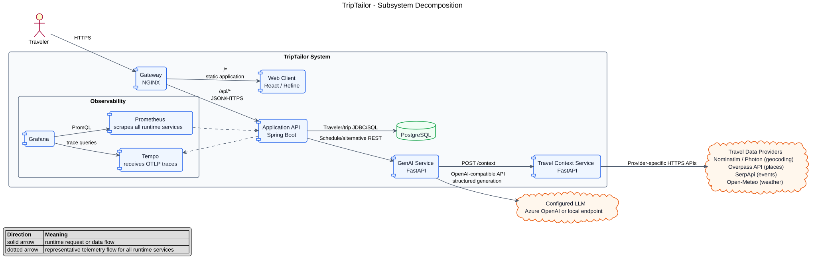
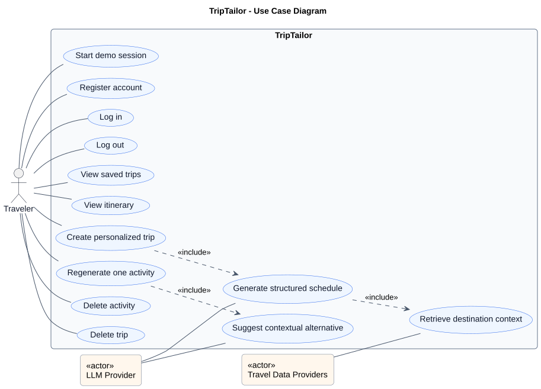
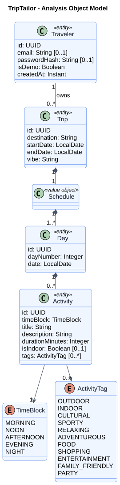

# Continuous Vacation (Dynamic Travel Itinerary Builder)

## Deployments

- **Azure:** https://tum-triptailor-354f93b6.polandcentral.cloudapp.azure.com/
- **AET Kubernetes:** https://team-continuous-vacation.stud.k8s.aet.cit.tum.de/

## Problem Statement

Planning a trip is often overwhelming, requiring travelers to juggle multiple websites, blogs, and notes to build a coherent daily schedule. While standard AI tools can suggest itineraries, they usually provide static, overwhelming walls of text. If a traveler needs to change one detail, like swapping an outdoor activity due to rain, they have to start over, which often messes up the rest of the timeline. This application solves this by providing a dynamic, visual itinerary where individual time blocks can be independently adjusted, saved, and managed with ease.

### What is the main functionality?

- **Instant Access:** Users can immediately dive into the app and start planning using a seamless demo profile, skipping lengthy registration processes entirely.
- **Custom and Adaptive Trip Creation:** Users input a destination, travel dates, and a preferred "vibe" (e.g., Foodie, Historic, Relaxing). Then the system in the background will fetch the weather forecast and upcoming events for the chosen time period. With all this information at hand the system generates a highly customized, day-by-day itinerary.
- **Visual Schedule Display:** Instead of a chat interface, the itinerary is presented as an easy-to-read, structured schedule divided into specific Days and time blocks (Morning, Afternoon, Evening).
- **Micro-Regeneration (Spot Editing):** Users can tweak a single activity block (e.g., typing "Swap this for an indoor activity") without regenerating or breaking the rest of their trip schedule.
- **Trip Dashboard & Auto-Save:** All generated itineraries and micro-edits are automatically saved. Users are greeted with a clean dashboard where they can view, resume, or delete their planned trips to keep their workspace organized.
- **Graceful Error Handling:** If the AI encounters a hiccup while generating a plan, the app safely catches the issue and provides a friendly prompt to try again, ensuring the app never freezes or crashes.

### Who are the intended users?

- Casual travelers and weekend backpackers who want to quickly draft a structured travel schedule without spending hours researching.
- Travelers who need on-the-fly flexibility to adjust specific parts of their plans due to weather, changing interests, or time constraints.

### How will you integrate GenAI meaningfully?

- The AI acts as an intelligent, behind-the-scenes travel agent rather than a conversational chatbot.
- To improve the generation, we provide the LLM with the user's destination, dates, and vibe, as well as the weather forecast and upcoming events for the chosen time period (retrieval-augmented generation). This allows the AI to generate a more personalized and context-aware itinerary.
- Instead of generating free-flowing text, the AI is strictly constrained to output structured scheduling data. It takes the user's destination, dates, and vibe, and returns precise daily activities complete with titles, descriptions, and durations.
- The AI is also used for targeted problem-solving. When a user wants to change a specific block, the AI understands the context of that single activity and offers a suitable replacement based on the user's instructions, leaving the rest of the itinerary perfectly intact.

### Describe some scenarios of how your app will function

**Scenario 1: The Initial Generation (Full System Flow)**
The user opens the app and enters "Munich, 3 days in mid-May, sporty vibe." The application processes this request through the AI engine and fetches time-frame relevant information (weather, events) on the fly. After a few seconds, the user is presented with a beautifully formatted 3-day schedule, neatly divided into morning, afternoon, and evening blocks with specific activities. This trip is automatically saved to their personal dashboard so they can close the app and return to it later.

**Scenario 2: The Rainy Day Swap (Micro-Regeneration)**
While reviewing their saved trip, the user looks at Day 2, Afternoon: "Walking tour of the English Garden." Realizing that the user has not yet visited any Museum, they click an "Edit" button on that specific activity block and type "Lets switch this to a cultural activity." The AI processes this targeted request and suggests "Visit the Deutsches Museum." The schedule instantly updates that single card on the screen, keeping the morning and evening plans exactly as they were.

## Local Configuration

The travel context service uses SerpApi for Google Events. Create `travel-context-service/.env` from `travel-context-service/.env.example` and set `SERPAPI_API_KEY`; without it, event lookup is skipped, and trip context responses contain no events.

## Service Map

TripTailor runs as four application services plus Postgres:

| Service | Path | Responsibility |
| --- | --- | --- |
| Frontend | `frontend/` | React, Vite, and Refine UI for authentication, trip creation, trip listing, and itinerary editing. |
| Backend API | `backend/` | Public Spring Boot backend-for-frontend. Owns auth, JWT validation, trip orchestration, PostgreSQL persistence, and calls to internal services. |
| GenAI Service | `genai-service/` | Internal FastAPI service that prompts the configured LLM and validates structured itinerary output. |
| Travel Context Service | `travel-context-service/` | Internal FastAPI enrichment service for geocoding, events, weather, ranking, and cache-backed provider calls. |
| Database | Docker Compose / Helm | PostgreSQL backing the backend. |

In Docker Compose and Kubernetes, the gateway exposes the frontend and routes `/api/*` to the backend. GenAI, travel-context, and Postgres are internal implementation services.

### Local Ports (Docker Compose)

Running `docker compose up --build` publishes the following host ports. Services listed as *internal only* are reachable through the gateway or by other containers on the Compose network, not from the host.

| Service | Host Port | URL / Notes |
| --- | --- | --- |
| Gateway (NGINX) | `3000` | http://localhost:3000 — local main entry point; serves frontend, proxies `/api/*` to the backend, and routes `/grafana/` + `/prometheus/` to the monitoring UIs. |
| Swagger UI | via `3000` | http://localhost:3000/api/ — interactive docs for all three contracts; pick the spec from the selector in the top bar. |
| Grafana | `3001` | http://localhost:3001 (or via the gateway at http://localhost:3000/grafana/) — dashboards and trace exploration (anonymous admin). |
| Tempo | `3200`, `4317`, `4318` | Trace query API (`3200`), OTLP gRPC (`4317`), OTLP HTTP (`4318`). No UI of its own — traces are viewed through Grafana's Tempo datasource. |
| Prometheus | `9090` | http://localhost:9090 (or via the gateway at http://localhost:3000/prometheus/) — metrics and alerts. |
| Travel Context Service | `8090` | http://localhost:8090 — internal enrichment service, also exposed for local debugging. |
| GenAI Service | `8000` | http://localhost:8000 — internal generation service, also exposed for local debugging and Swagger "Try it out". |
| PostgreSQL | `5433` | Host `5433` → container `5432` (user `tripuser`, db `triptailor`). |
| Frontend | — | Internal only; reach via the gateway on `3000`. |
| Backend API | — | Internal only (`8080`); reach via the gateway `/api/*`. |

### Monitoring in Kubernetes and Azure

The same Prometheus + Grafana + Tempo suite ships to both deployment targets:

- **Kubernetes (Helm chart `infrastructure/kubernetes/triptailor/`):** Prometheus, Grafana, and Tempo run as in-cluster Deployments, and distributed tracing is enabled by default (`tracing.enabled: true`). Toggle the stack with `monitoring.enabled`, individual components with `monitoring.grafana.enabled` / `monitoring.tempo.enabled`, and tracing export with `tracing.enabled`. Grafana/Prometheus are `ClusterIP` — reach them with `kubectl port-forward` (or add ingress rules).
- **Azure VM (Ansible + Docker Compose):** the playbook runs the root `docker-compose.yml` with an Azure-only override, so the full suite comes up automatically. NGINX terminates HTTPS with a Let's Encrypt certificate managed by Certbot. Grafana and Prometheus are reachable through the gateway at `https://<vm-fqdn>/grafana/` and `https://<vm-fqdn>/prometheus/`. Tempo stays internal.

## Architecture

TripTailor uses independently deployable services with explicit HTTP contracts. The browser loads the React application through the NGINX gateway and sends all application requests to the public Spring Boot backend. That backend is the system's security and orchestration boundary: it authenticates travelers with signed JWTs, validates public requests, coordinates trip generation, and prevents clients from calling internal services directly.

The backend owns durable state directly in PostgreSQL through Spring JDBC. For trip creation and activity regeneration, the backend calls the GenAI service. The GenAI service builds prompts, requests structured output from the configured LLM, validates that output with Pydantic models, and assigns the identifiers required by the application contract. Before schedule generation, it requests destination context from the travel-context service. That service encapsulates geocoding, event, and weather providers, including caching and ranking, so provider-specific concerns do not leak into trip orchestration.

All application-owned HTTP service interfaces use JSON and are described in `api-specification/`. The public contract is `frontend.yaml`; internal contracts isolate GenAI and travel-context behavior. Runtime deployment is available through Docker Compose and the Helm chart. Prometheus scrapes every backend service, Grafana visualizes the exported metrics, and Tempo receives distributed traces.

The relational database schema and persistent storage setup are documented in
[`docs/database.md`](docs/database.md). The executable schema is
`backend/src/main/resources/schema.sql`.

### Generation and persistence flow

1. The browser sends `POST /api/trips` to the backend through NGINX.
2. The backend validates the request and calls GenAI at `POST /schedules`.
3. GenAI calls travel context at `POST /trip-context`. Nominatim geocodes the
   destination, with Photon as fallback; the coordinates and country metadata
   are then used for Open-Meteo weather and optional SerpApi event lookup.
4. GenAI calls the configured OpenAI-compatible LLM and validates its structured
   response. Trips may contain at most seven inclusive calendar days.
5. The backend writes the traveler, trip, days, activities, and tags directly to
   PostgreSQL using Spring JDBC, then returns the persisted trip to the browser.

Travel context is best effort from GenAI's perspective: a timeout or invalid
travel-context response is logged and schedule generation continues without
enrichment. Within travel context, events and weather degrade to empty results;
geocoding first tries Nominatim and then Photon. The travel-context caches are
bounded in-memory TTL caches scoped to one service process/pod, not distributed
across Kubernetes replicas.

### Normal, mocked, and real-provider smoke modes

Application code always performs ordinary HTTP provider calls. The selected
Compose files decide where those calls go:

| Mode | Command/configuration | Provider behavior |
| --- | --- | --- |
| Normal | `docker compose up --build` | Uses provider URLs and LLM settings from the normal environment files. |
| Deterministic CI | `COMPOSE_FILE=docker-compose.yml:docker-compose.ci.yml docker compose up --build` | Overrides provider base URLs so the same production clients call `mock-providers`. No external provider secrets or costs are required. |
| Controlled real smoke | `REAL_PROVIDER_SMOKE=true bash scripts/docker-compose-smoke.sh` against the normal stack | Makes one real generation request using locally configured secrets; generated payloads and secrets are not printed. |

In the CI override, `LLM_PROVIDER=local` means an OpenAI-compatible HTTP
endpoint and points to the mock server. Outside CI it can point to a compatible
local runtime such as Ollama. The smoke script detects deterministic mode by
checking whether the merged Compose project contains the `mock-providers`
service.

### Subsystems and interfaces

| Caller | Callee | Interface | Responsibility |
| --- | --- | --- | --- |
| Browser frontend | Backend API | `/api/*` through NGINX; public OpenAPI contract | Authentication and traveler-facing trip workflows |
| Backend API | GenAI service | Internal REST; GenAI OpenAPI contract | Schedule generation and contextual activity alternatives |
| GenAI service | Travel-context service | `POST /trip-context`; travel-context OpenAPI contract | Geocoding, event, and weather context |
| Backend API | PostgreSQL | JDBC/SQL | Durable application state (travelers, trips, days, activities) |
| GenAI service | Configured LLM | OpenAI-compatible HTTPS API | Schema-constrained schedule and activity generation |
| Travel-context service | External providers | Provider-specific HTTPS APIs | Geocoding, events, and weather |
| Prometheus | Runtime services | `/actuator/prometheus` or `/metrics` | Metrics collection and alert evaluation |
| Runtime services | Tempo | OTLP/HTTP | Distributed trace export |
| Grafana | Prometheus and Tempo | PromQL and trace queries | Operational dashboards and trace exploration |

### UML diagrams

The PlantUML sources in `diagrams/` are version-controlled documentation of the implemented system:

- [Subsystem Decomposition](diagrams/subsystem-decomposition.puml) — deployable subsystems, external dependencies, runtime interfaces, and telemetry paths.
- [Use Case Diagram](diagrams/use-case-diagram.puml) — traveler goals and the supporting LLM and travel-data actors.
- [Analysis Object Model](diagrams/analysis-object-model.puml) — implementation-aligned domain entities and their cardinalities.
- [Itinerary Creation Flow](diagrams/creation-flow-diagram.puml) — request sequence for generating and saving a trip.
- [Activity Update Flow](diagrams/update-flow-diagram.puml) — request sequence for regenerating one activity.
- [Class Diagram](diagrams/class-diagram.puml) — detailed trip and activity data types.

#### Subsystem Decomposition



#### Use Case Diagram



#### Analysis Object Model



## Local Commands

Run commands from the module directory unless noted.

| Area | Validate | Coverage |
| --- | --- | --- |
| Frontend | `npm run lint && npm run test && npm run build` | `npm run test:coverage` |
| Backend API | `./gradlew build` (includes Detekt) | `./gradlew test jacocoTestReport` |
| GenAI Service | `flake8 app tests && mypy app && python -m pytest --verbose` | `python -m pytest --cov=app --cov-report=term-missing --cov-report=xml --cov-report=html` |
| Travel Context Service | `flake8 app tests && mypy app && python -m pytest --verbose` | `python -m pytest --cov=app --cov-report=term-missing --cov-report=xml --cov-report=html` |
| Full local stack | `docker compose up --build` | Not applicable; use module coverage commands. |
| Cross-service integration | See `integration-tests/README.md` | Not applicable; covers wiring, not lines. |

Python services use Python 3.11 in CI and container images. Recreate local
virtual environments with Python 3.11 and install dependencies from
`requirements.txt` and `requirements-dev.txt` to avoid version-specific drift.

### Cross-service integration tests

The module suites stub each other out, so none of them can catch a contract drift between two
services. `integration-tests/` closes that gap: it runs the real stack and fakes only third-party
APIs (the LLM, Nominatim, SerpAPI, Open-Meteo) with a WireMock container from
`docker-compose.ci.yml`.

```bash
docker compose -f docker-compose.yml -f docker-compose.ci.yml up --build --detach --wait
bash scripts/docker-compose-smoke.sh
pip install -r integration-tests/requirements.txt && pytest integration-tests
docker compose -f docker-compose.yml -f docker-compose.ci.yml down --volumes --remove-orphans
```

Pass both `-f` flags to every compose command; see `integration-tests/README.md` for the stub
contracts and for debugging a mismatch.

## CI/CD

GitHub Actions runs `.github/workflows/ci.yaml` for every pull request targeting `main` and every push to `main`. The pipeline treats all quality checks as blocking:

- Frontend: ESLint, Vitest with coverage, TypeScript compilation, and the production build.
- Kotlin services: Detekt static analysis as its own step, then the Gradle build, JUnit tests, and JaCoCo coverage.
- Python services: Flake8 over application and test code, mypy type checking, and pytest with coverage.
- Full stack: Docker Compose image builds after every service job succeeds, then a smoke test and the cross-service integration tests.

Coverage reports are uploaded as workflow artifacts. Deployment and container-image workflows are defined separately in `.github/workflows/`.

Detekt findings are uploaded as SARIF (merged across source sets into one file), so they appear as GitHub code scanning alerts and inline annotations on the pull request diff rather than only in the job log.

Detekt currently **reports rather than blocks** (`ignoreFailures = true` in `backend/build.gradle.kts`). There is deliberately no baseline file: a baseline exists to freeze pre-existing findings so a build can fail on new ones, which suits a codebase too large to clean up in one go. This backend is small enough that a baseline would mostly park real findings in an XML nobody reads, so the open findings are visible in code scanning instead.

The trade-off is that new violations do not fail the build either. Once the open findings are fixed, flip `ignoreFailures` to `false` to make Detekt blocking.

`check` runs `detektMain`/`detektTest` rather than the plugin's default `detekt` task, so a local `./gradlew build` reports exactly what CI reports. Those tasks analyse with type resolution and catch strictly more.

## Monitoring & Observability

Prometheus and Grafana configuration has a single source of truth in
`infrastructure/kubernetes/triptailor/files/monitoring/` (see its `README.md`), shared by
`docker-compose.yml` (via the repo-root `monitoring` symlink) and the Helm chart. All
runtime services expose metrics: Spring services at `/actuator/prometheus`, FastAPI
services at `/metrics`. Alert rules live in
`infrastructure/kubernetes/triptailor/files/monitoring/prometheus/alert.rules.yml`
(service-down, request-failure-rate, and high-latency alerts). Exported Grafana
dashboards are checked in at
`infrastructure/observability/grafana/dashboards/triptailor-services.json`.

## Deployment

The system deploys to two environments:

- **Rancher / AET (course infrastructure):** Kubernetes via the Helm chart in
  `infrastructure/kubernetes/triptailor/`, deployed automatically on merge to `main`
  by `.github/workflows/images.yaml`. Live instance:
  `https://team-continuous-vacation.stud.k8s.aet.cit.tum.de/`. See
  `infrastructure/kubernetes/README.md` for details.
- **Azure (cloud option):** a single VM provisioned by Terraform
  (`infrastructure/terraform/`) and configured by Ansible
  (`infrastructure/ansible/playbook.yml`), running the same services via Docker
  Compose. Deployed by `.github/workflows/azure-vm-deploy.yaml`.

## Student Responsibilities

| Team Member | Primary Subsystem |
| --- | --- |
| Florian | Backend, Persistence, Tracing |
| Jonas | Frontend, Weather Travel Context Service, Prometheus |
| Thomas | GenAI Service, Travel Context Service, Grafana |

Subsystem ownership does not imply isolated work — all members collaborate across
boundaries for integration, deployment, and debugging (see `AGENTS.md` for module
layout and conventions).

## Source Of Truth And Generated Files

- OpenAPI contracts live in `api-specification/`.
- The backend hosts a single Swagger UI for all three contracts. With Docker Compose it is at http://localhost:3000/api/ (through the gateway); running the backend alone it is at http://localhost:8080/. Use the selector in the top bar to switch specs:

  | Spec | Raw URL (via gateway) |
  | --- | --- |
  | App API (public) — `frontend.yaml` | http://localhost:3000/api/openapi.yaml |
  | GenAI API (internal) — `gen-ai.yaml` | http://localhost:3000/api/gen-ai.yaml |
  | Travel Context API (internal) — `travel-context.yaml` | http://localhost:3000/api/travel-context.yaml |

  "Try it out" works for all three specs **locally**: the App API goes through the gateway, while the two internal specs declare absolute `servers` (`http://localhost:8000` and `http://localhost:8090`) and rely on those ports being published by Docker Compose. Because those URLs are hardcoded to `localhost`, "Try it out" on the internal specs does **not** work against a remote deployment — a browser would resolve `localhost` to its own machine. There the internal specs are reference documentation only; the App API is unaffected, since it uses a relative server URL. Both Python services additionally serve FastAPI's own generated docs at `/docs` (http://localhost:8000/docs, http://localhost:8090/docs).
- `backend/src/main/resources/{openapi,gen-ai,travel-context}.yaml` are copied from `api-specification/` by Gradle resource processing and are git-ignored.
- `frontend/src/lib/api-types.ts` is generated from `api-specification/frontend.yaml` with `npm run generate-api-types`.
- Build output, coverage reports, virtual environments, copied OpenAPI resources, and generated frontend API types are ignored and should not be edited by hand.
